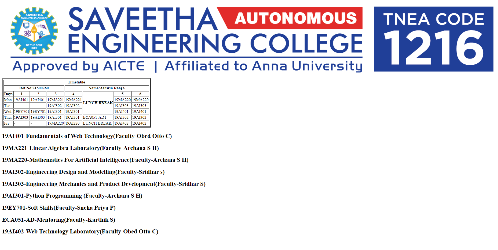
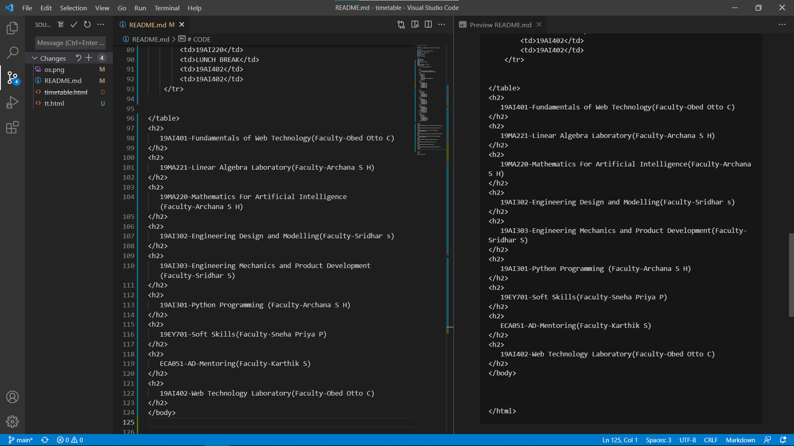
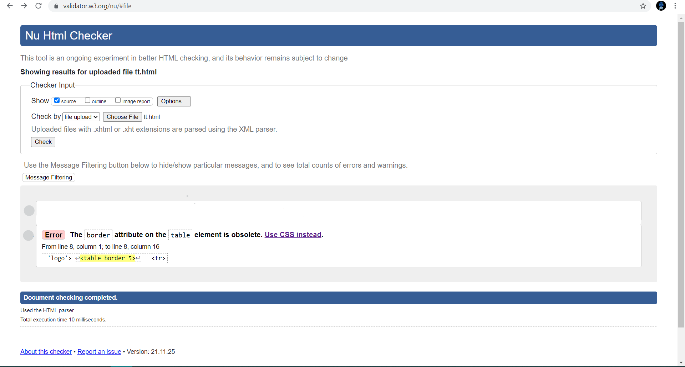

# Experiment_Time_Table

## AIM
To Write a html webpage page to display your timetable.

# ALGORITHM
### STEP 1
create a simple table using table tag
### STEP 2
Add header row using th tag
### STEP 3
Add your timetable
### STEP 4
Execute the program

# CODE
~~~
<!DOCTYPE html>
<html lang='en'>
<head>
<title>TimeTable</title>
</head>
<body>
 
<table border=5>
	<tr>
    	<th colspan=8>Timetable</th>
       
        
    </tr>
    <tr>
    	<th colspan=4>Ref No:21500260</th>
        <th colspan=4>Name:Ashwin Raaj.S</th>   
    </tr>
    <tr>
    	<th>Days</th>
    	<th>1</th>
        <th>2</th>
        <th>3</th>
        <th>4</th>
        <th rowspan=4>LUNCH BREAK</th>
        <th>5</th>
        <th>6</th>
    </tr>
    <tr>
    	<td>Mon</td>
        <td>19AI401</td>
        <td>19AI401</td>
        <td>19MA221</td>
        <td>19MA221</td>
        <td>19MA220</td>
        <td>19MA220</td>
        
        
    </tr>
    <tr>
    	<td>Tue</td>
    	<td>-</td>
        <td>-</td>
        <td>19AI302</td>
        <td>19AI302</td>
        <td>19AI303</td>
        <td>19AI303</td>
    </tr>
    <tr>
    	<td>Wed</td>
    	<td>19EY701</td>
        <td>19EY701</td>
        <td>19AI301</td>
        <td>19AI301</td>
        <td>19AI401</td>
        <td>19AI401</td>
    </tr>
    <tr>
    	<td>Thur</td>
    	<td>19AI303</td>
        <td>19AI303</td>
        <td>19AI301</td>
        <td>19AI301</td>
	<td>ECA051-AD1</td>
        <td>19AI302</td>
        <td>19AI302</td>
    </tr>
    <tr>
    	<td>Fri</td>
    	<td>-</td>
        <td>-</td>
        <td>19MA220</td>
        <td>19AI220</td>
        <td>LUNCH BREAK</td>
        <td>19AI402</td>
        <td>19AI402</td>
    </tr>
    
        
</table>
<h2>
   19AI401-Fundamentals of Web Technology(Faculty-Obed Otto C)
</h2>
<h2>
   19MA221-Linear Algebra Laboratory(Faculty-Archana S H)
</h2>
<h2>
   19MA220-Mathematics For Artificial Intelligence(Faculty-Archana S H)
</h2>
<h2>
   19AI302-Engineering Design and Modelling(Faculty-Sridhar s)
</h2>
<h2>
   19AI303-Engineering Mechanics and Product Development(Faculty-Sridhar S)
</h2>
<h2>
   19AI301-Python Programming (Faculty-Archana S H)
</h2>
<h2>
   19EY701-Soft Skills(Faculty-Sneha Priya P)
</h2>
<h2>
   ECA051-AD-Mentoring(Faculty-Karthik S)
</h2>
<h2>
   19AI402-Web Technology Laboratory(Faculty-Obed Otto C)
</h2>
</body>

</html>
~~~
# OUTPUT

